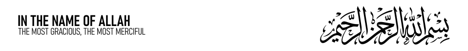
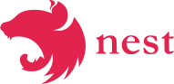
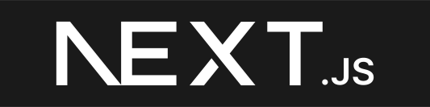
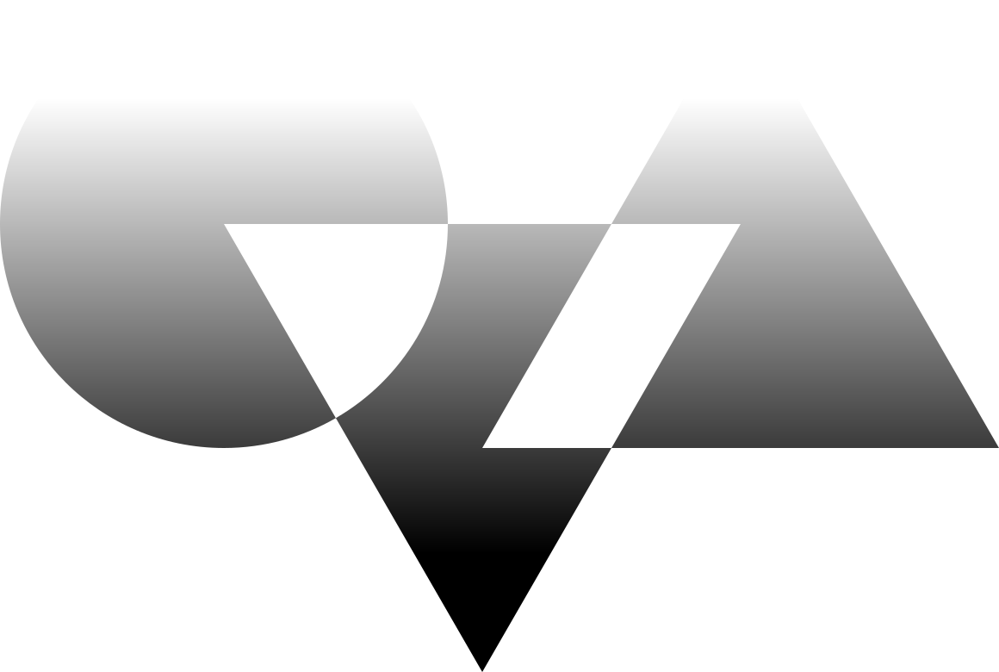

---

Just your average open-source enjoyer, hobbyist programmer, and certified islamist.

Mainly using these weapons to commit war crimes:

Rust as well but not that often,

and also knows some C and C++ tricks.